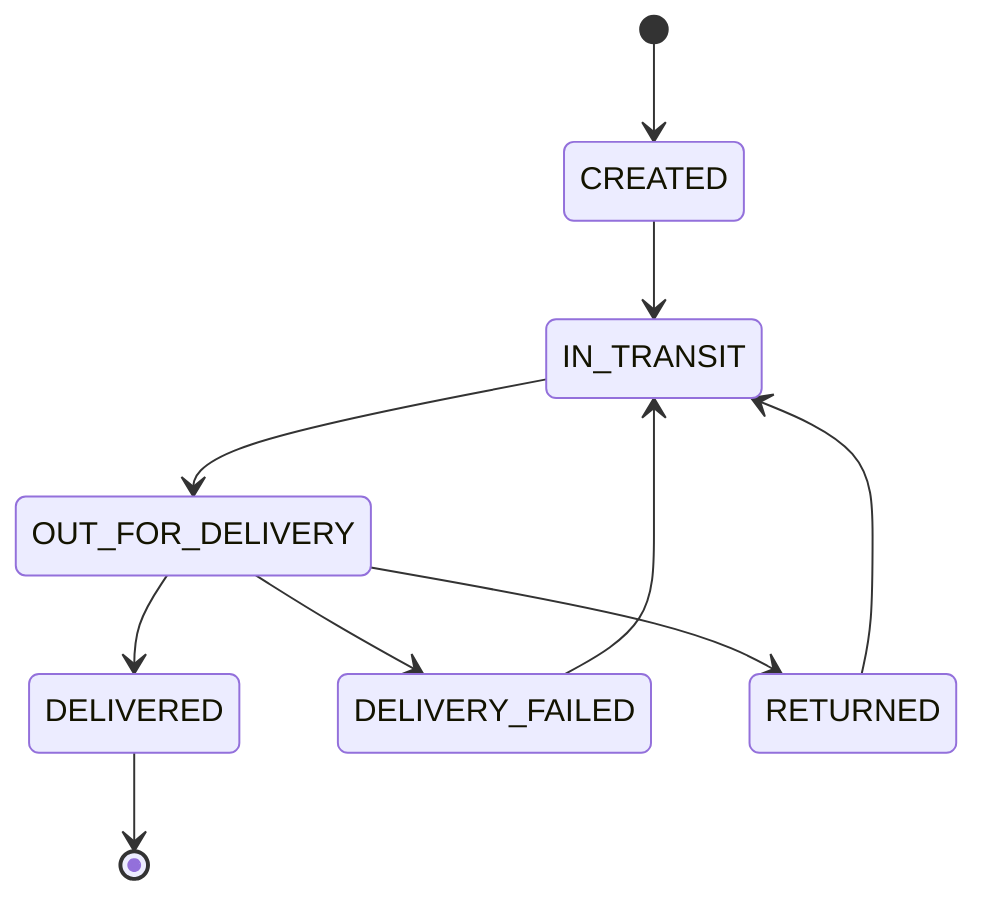

# LogiTrack - Package Tracking System

[](https://www.oracle.com/java/)
[](https://spring.io/projects/spring-boot)
[](https://www.postgresql.org/)
[](https://kafka.apache.org/)
[](LICENSE)

## Overview

LogiTrack is a comprehensive package tracking system built with **Hexagonal Architecture** (Ports and Adapters). It provides real-time tracking, status updates, and location history for packages throughout their delivery lifecycle.

## Architecture

The project follows **Hexagonal Architecture** principles:
```
src/
├── domain/           # Business logic & entities (Core)
├── application/      # Use cases & services
└── infrastructure/   # External adapters (DB, Web, Kafka)
```

## Features

- **Package Management**: Create, update, and track packages
- **State Machine**: Robust state transitions with State Pattern
- **Event-Driven**: Kafka integration for real-time events
- **Location Tracking**: Historical location tracking with timestamps
- **RESTful API**: Complete REST API with OpenAPI documentation
- **Security**: JWT-based authentication and role-based access control
- **Database Versioning**: Flyway for database migrations

## Quick Start

### Prerequisites

- Java 17+
- Docker & Docker Compose
- Maven 3.8+

### 1. Clone the repository
```bash
git clone https://github.com/yourusername/logitrack.git
cd logitrack
```

### 2. Start infrastructure services
```bash
docker-compose up -d
```

This will start:
- PostgreSQL (port 5432)
- Apache Kafka (port 9092)
- Kafka UI (port 8081)
- SonarQube (port 9000)

### 3. Build the application
```bash
mvn clean install
```

### 4. Run the application
```bash
mvn spring-boot:run
```

The application will be available at `http://localhost:8080`

## API Documentation

Once the application is running, access the Swagger UI at:
```
http://localhost:8080/swagger-ui.html
```

### Authentication

The API uses JWT for authentication. To get started:

1. Get a token:
```bash
curl -X POST http://localhost:8080/api/v1/auth/login \
  -H "Content-Type: application/json" \
  -d '{"email":"admin@logitrack.com","password":"admin123"}'
```

2. Use the token in subsequent requests:
```bash
curl -X GET http://localhost:8080/api/v1/packages \
  -H "Authorization: Bearer <your-token>"
```

### Test Credentials

| Email | Password | Role |
|-------|----------|------|
| admin@logitrack.com | admin123 | ADMIN |
| operator@logitrack.com | operator123 | OPERATOR |
| viewer@logitrack.com | viewer123 | VIEWER |

## Package Status Flow


## Testing

### Run all tests
```bash
mvn test
```

### Run with coverage
```bash
mvn clean test jacoco:report
```

Coverage report will be available at `target/site/jacoco/index.html`

### SonarQube Analysis
```bash
mvn clean verify sonar:sonar \
  -Dsonar.host.url=http://localhost:9000 \
  -Dsonar.login=your-token
```

##  Database

The application uses PostgreSQL with Flyway for migrations. Initial data includes sample packages in all states.

### Access the database
```bash
docker exec -it logitrack-postgres psql -U logitrack_user -d logitrack
```

## Kafka Topics

The application publishes events to the following topics:

- `package-events`: All package-related events
- `package-status`: Status change events
- `package-location`: Location update events

Monitor events using Kafka UI at `http://localhost:8081`

## Configuration

Key configuration properties in `application.yml`:
```yaml
spring:
  datasource:
    url: jdbc:postgresql://localhost:5432/logitrack
    username: logitrack_user
    password: logitrack_pass
    
  kafka:
    bootstrap-servers: localhost:9092
    
external:
  geocode:
    api:
      url: https://api.opencagedata.com/geocode/v1
      key: ${GEOCODE_API_KEY:demo-key}
```